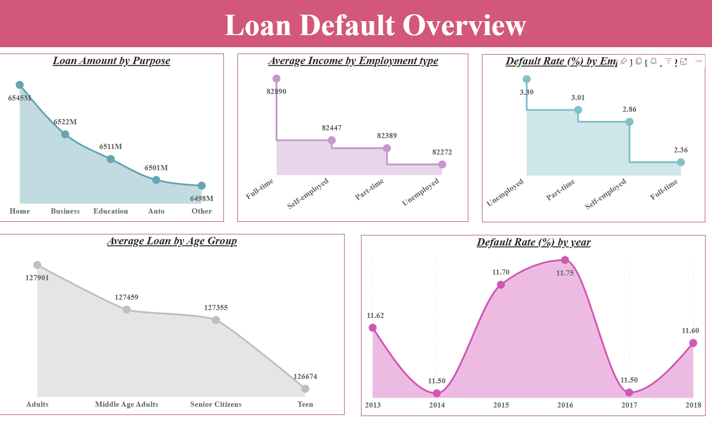
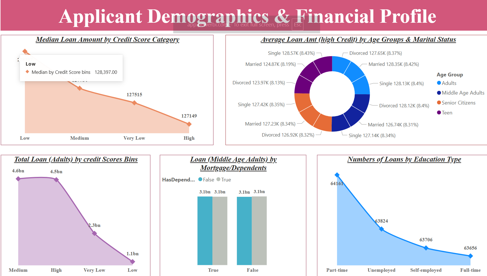
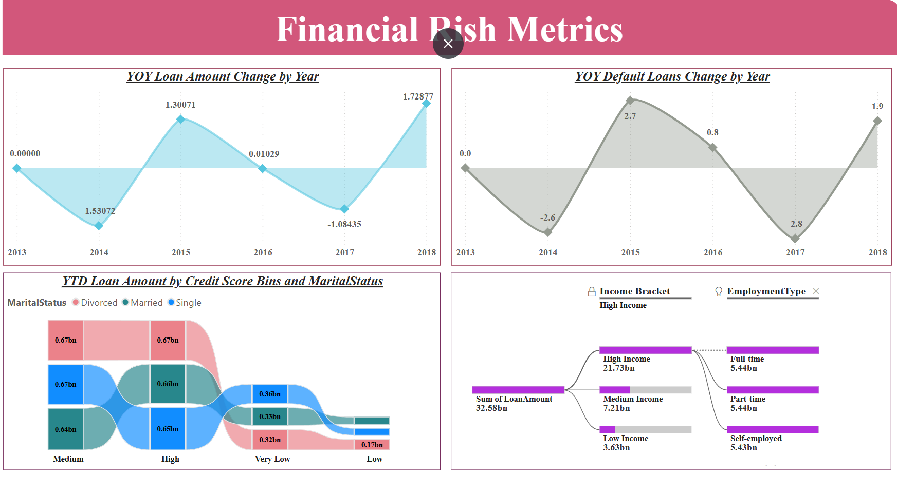

# 📊 Power BI Dashboard: Loan Default Analysis

## 📁 Project Description

This Power BI report provides a comprehensive analysis of loan default trends, applicant demographics, and financial risk metrics. It is designed to help financial analysts, risk officers, and business stakeholders gain insights into loan disbursement patterns and associated risks across different demographics and economic segments.

---

## 📌 Dashboard Sections & Key Insights

### 1️⃣ **Loan Default Overview**

- **Loan Purpose**: Home and business loans account for the highest disbursements.
- **Income & Default Rate by Employment Type**:
  - Full-time employees earn the most and have the lowest default rate (2.36%).
  - Unemployed applicants show the highest default rate (3.39%).
- **Age Groups**:
  - Adults have the highest average loan amounts.
  - Teens show the lowest loan amounts and a high risk factor.
- **Yearly Default Trends**:
  - Default rates peaked in 2015 and 2016 at ~11.7%, showing volatility in risk levels.

### 2️⃣ **Applicant Demographics & Financial Profile**

- **Credit Score Categories**:
  - Applicants with low credit scores tend to receive higher median loan amounts.
- **Marital & Age Group Combinations**:
  - Adults and married applicants dominate the loan distribution.
- **Education & Employment**:
  - Part-time and unemployed applicants take more loans compared to full-time workers.
- **Dependents & Mortgages**:
  - Middle-aged adults show consistent loan amounts irrespective of dependents.

### 3️⃣ **Financial Risk Metrics**

- **YOY Loan Trends**:
  - Loan disbursement increased sharply in 2015 and 2018.
  - Notable dips were observed in 2014 and 2017.
- **Default Loan Changes**:
  - 2015 saw a spike in default loan changes (+2.7).
- **Credit Score & Marital Status Influence**:
  - Married applicants dominate high and medium credit score bands.
- **Income & Employment Impact**:
  - High-income individuals mostly work full-time, while low-income groups are split across employment types.

---

## 🔧 Tools & Technologies Used

- **Microsoft Power BI**
- **DAX** (Data Analysis Expressions)
- **Power Query (M Language)**

---

## 📷 Dashboard Preview

  
  

> *(Replace the image paths above with the correct relative path in your repo or cloud folder.)*

---

## 💡 Use Cases

- **Credit Risk Evaluation**
- **Loan Product Segmentation**
- **Default Trend Forecasting**
- **Customer Segmentation by Financial Profile**

---

